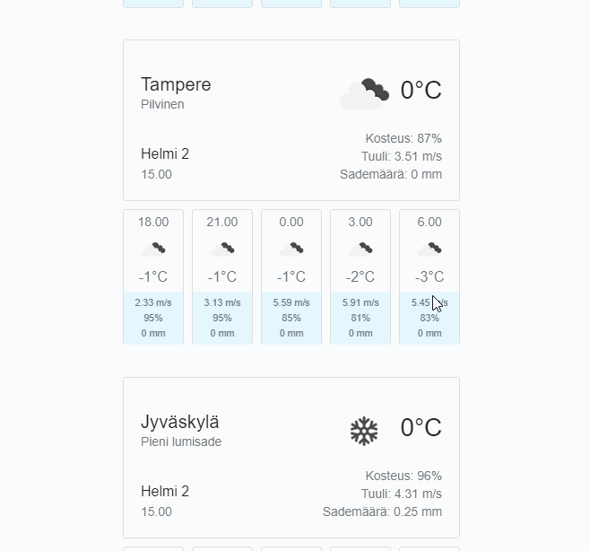

# Simple weather app
Simple weather app using Vue.js

Weather data is collected from OpenWeatherMap API.

This project is made by Asko Lahti



# Installation
* Install Nodejs (I used v12.14.1 in this project) [download link](https://nodejs.org/en/)
* Clone this repository in a folder of your choice
* Copy the **data/weatherOptionsSample.json** and place it in a same folder. Rename the file to **"data/weatherOptions.json"**.
* From weatherOptions.json, you have to change **"apiKey"** to your own account's OpenWeatherMap API key. If you don't have an account yet, you can [create your account here](https://openweathermap.org/).


data/weatherOptions.json
```
{
    "apiKey": "xxxxxxxxxxxxxxxxxxxxxxxxxx", <--- Your own API key from OpenWeatherMap
    "appHost": "api.openweathermap.org", <--- Api url to OpenWeatherMap
    "appPath": "/data/2.5/forecast", <--- 5 Day forecast path
    "cityCodes": [658225,634964,655195,650225] <--- Citycodes
}
```
**Optional:** You can change citycodes to anything you want and add as many you like. For more information about city codes in OpenWeatherMap [read this page](https://openweathermap.org/forecast5).

* In terminal go to root of this repository folder and write command:
> npm install
* After it has installed all dependencies, write command:
> npm start

If nothing has gone wrong you should have working weather app. **Congratulations**
